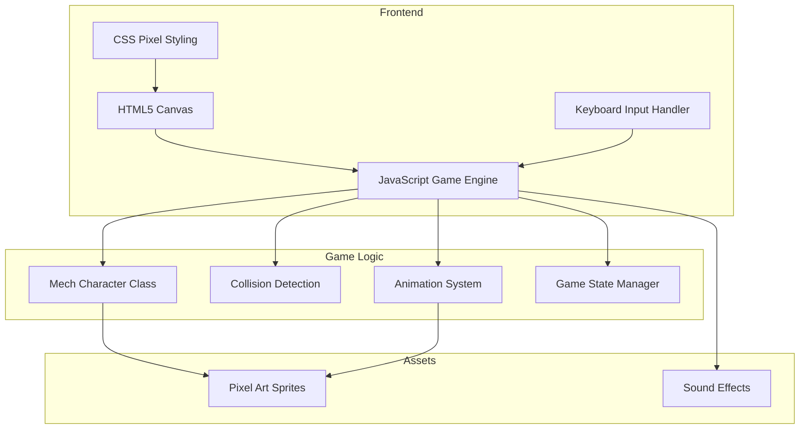

## 1. Architecture Design



## 2. Technology Description
- Frontend: 原生HTML5 + JavaScript + CSS3 (无框架，保持轻量和像素风格)
- Canvas: HTML5 Canvas API 用于渲染
- Animation: requestAnimationFrame 实现游戏循环
- Input: KeyboardEvent API 处理按键输入
- Styling: CSS像素风格，使用Press Start 2P字体

## 3. 核心模块设计

### 3.1 Mech Class (机甲角色类)
```javascript
class Mech {
  constructor(x, y, color, controls) {
    this.x = x;              // X坐标
    this.y = y;              // Y坐标
    this.width = 48;         // 宽度
    this.height = 64;        // 高度
    this.color = color;      // 主色调
    this.controls = controls; // 按键控制映射
    this.health = 100;       // 血量
    this.velocityX = 0;      // X轴速度
    this.velocityY = 0;      // Y轴速度
    this.isGrounded = false; // 是否在地面
    this.isAttacking = false;// 是否在攻击
    this.isDefending = false;// 是否在防御
    this.attackCooldown = 0; // 攻击冷却
    this.frame = 0;          // 动画帧
    this.state = 'idle';     // 当前状态
  }
  
  update(keys, groundY, opponent) {
    // 更新物理、状态、碰撞检测
  }
  
  draw(ctx) {
    // 绘制机甲角色
  }
  
  attack() {
    // 发起攻击
  }
  
  defend() {
    // 开始防御
  }
  
  takeDamage(amount) {
    // 受到伤害
  }
}
```

### 3.2 GameState Class (游戏状态管理)
```javascript
class GameState {
  constructor() {
    this.phase = 'menu';     // 游戏阶段: menu, playing, gameover
    this.winner = null;      // 获胜者
  }
  
  startGame() {
    this.phase = 'playing';
    this.winner = null;
  }
  
  endGame(winner) {
    this.phase = 'gameover';
    this.winner = winner;
  }
  
  reset() {
    this.phase = 'menu';
    this.winner = null;
  }
}
```

### 3.3 Animation System (动画系统)
- 机甲状态: idle, walk, jump, attack, defend, hurt
- 每状态4-8帧动画
- 使用像素画绘制精灵
- 帧率控制在12fps

## 4. 按键控制映射

| 操作 | 玩家1 (左方) | 玩家2 (右方) |
|------|--------------|--------------|
| 左移 | A | Left Arrow |
| 右移 | D | Right Arrow |
| 跳跃 | W | Up Arrow |
| 攻击 | J | , (逗号) |
| 防御 | K | . (句号) |

## 5. 物理与碰撞系统

### 5.1 物理参数
- 重力: 0.8
- 跳跃力度: -15
- 移动速度: 5
- 攻击范围: 60像素
- 攻击伤害: 15
- 防御减伤: 80%

### 5.2 碰撞检测
- AABB碰撞检测算法
- 检测角色与地面碰撞
- 检测攻击与对方角色碰撞
- 检测角色边界

## 6. 像素艺术资源

### 6.1 色彩方案
- 玩家1 (蓝色机甲):
  - 主色: #00aaff
  - 阴影: #0066aa
  - 高光: #66ddff
  - 深色: #003366
  
- 玩家2 (红色机甲):
  - 主色: #ff4444
  - 阴影: #aa2222
  - 高光: #ff8888
  - 深色: #661111

- 背景:
  - 地面: #333333
  - 背景: #111122
  - 星星: #ffffff

### 6.2 画布尺寸
- 游戏画布: 800x400像素
- 地面高度: 60像素
- 角色尺寸: 48x64像素

## 7. 文件结构
```
/workspace/
├── index.html          # 主HTML文件
├── css/
│   └── style.css       # 样式文件
├── js/
│   ├── game.js         # 游戏主逻辑
│   ├── mech.js         # 机甲角色类
│   └── utils.js        # 工具函数
└── assets/             # 资源文件夹
```
