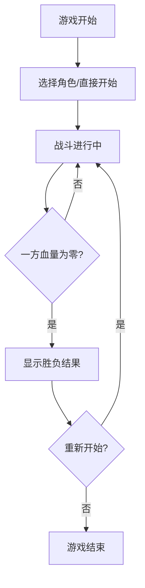

## 1. Product Overview
像素风机甲对战小游戏 - 一个双人对战的复古像素风格动作游戏，玩家可以控制两个机甲角色进行战斗。
- 主要目标：为玩家提供一个简单有趣的双人对战体验，包含移动、攻击、防御等核心玩法。
- 目标用户：喜欢像素风格游戏、简单对战游戏的玩家。

## 2. Core Features

### 2.1 User Roles
| Role | Registration Method | Core Permissions |
|------|---------------------|------------------|
| 玩家1 (左方) | 键盘操作 | 控制左方机甲移动、攻击、防御 |
| 玩家2 (右方) | 键盘操作 | 控制右方机甲移动、攻击、防御 |

### 2.2 Feature Module
1. **游戏主页面**: 像素风格游戏画布、角色选择、游戏控制说明、开始/重置按钮
2. **战斗场景**: 机甲角色动画、战斗特效、血量条显示、胜负判定

### 2.3 Page Details
| Page Name | Module Name | Feature description |
|-----------|-------------|---------------------|
| 游戏主页面 | 游戏画布 | 800x400像素画布，显示游戏场景和两个机甲角色 |
| 游戏主页面 | 控制说明 | 清晰展示两个玩家的按键操作说明 |
| 游戏主页面 | 开始/重置按钮 | 开始新游戏和重置当前游戏的功能 |
| 战斗场景 | 机甲控制 | 移动、跳跃、攻击、防御等操作 |
| 战斗场景 | 血量系统 | 实时显示两个机甲的血量条 |
| 战斗场景 | 胜负判定 | 一方血量归零时判定胜负并显示结果 |
| 战斗场景 | 角色动画 | 待机、移动、攻击、防御、受伤等像素动画 |

## 3. Core Process
游戏开始后，两个玩家分别控制自己的机甲进行对战。通过移动躲避对手攻击，在合适时机发起进攻或进行防御。当一方血量降至零时，游戏结束并显示胜负结果，玩家可以选择重新开始游戏。

## 4. User Interface Design

### 4.1 Design Style
- 主色调：深色背景配合霓虹蓝、霓虹红等复古像素风格配色
- 按钮风格：像素风格矩形按钮，带悬停和点击效果
- 字体：像素风格字体（Press Start 2P或类似字体）
- 布局风格：居中布局，游戏画布为核心元素，控制元素环绕
- 图标风格：像素化的emoji和自定义像素图标

### 4.2 Page Design Overview
| Page Name | Module Name | UI Elements |
|-----------|-------------|-------------|
| 游戏主页面 | 游戏画布 | 800x400像素深色背景，地面线条，战斗区域划分 |
| 游戏主页面 | 控制说明 | 像素风格的文字说明，按键图标展示 |
| 游戏主页面 | 开始/重置按钮 | 像素风格按钮，悬停变色 |
| 战斗场景 | 血量条 | 顶部显示的彩色像素化血量条 |
| 战斗场景 | 机甲角色 | 蓝红配色的像素机甲，带简单动画 |
| 战斗场景 | 攻击特效 | 像素化的攻击光波和爆炸效果 |
| 战斗场景 | 胜负界面 | 居中显示的胜利文字，带闪烁效果 |

### 4.3 Responsiveness
- 桌面端优先，最小支持800x600分辨率
- 游戏画布居中显示，控制元素自适应布局
- 键盘操作优化，不支持触摸操作

### 4.4 像素艺术指导
- 角色使用16x16或32x32像素网格绘制
- 使用有限的颜色调色板（每个角色不超过8种颜色）
- 动画使用逐帧动画，帧率控制在10-15fps以保持复古感
- 使用像素描边和块状阴影增强立体感
